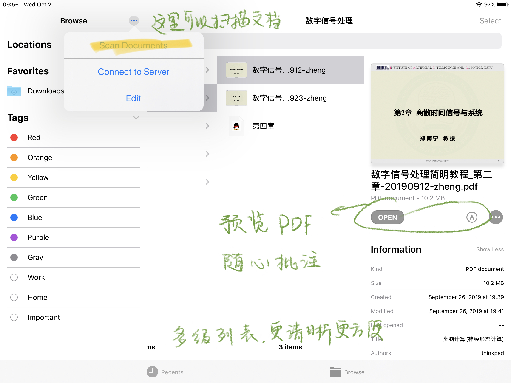
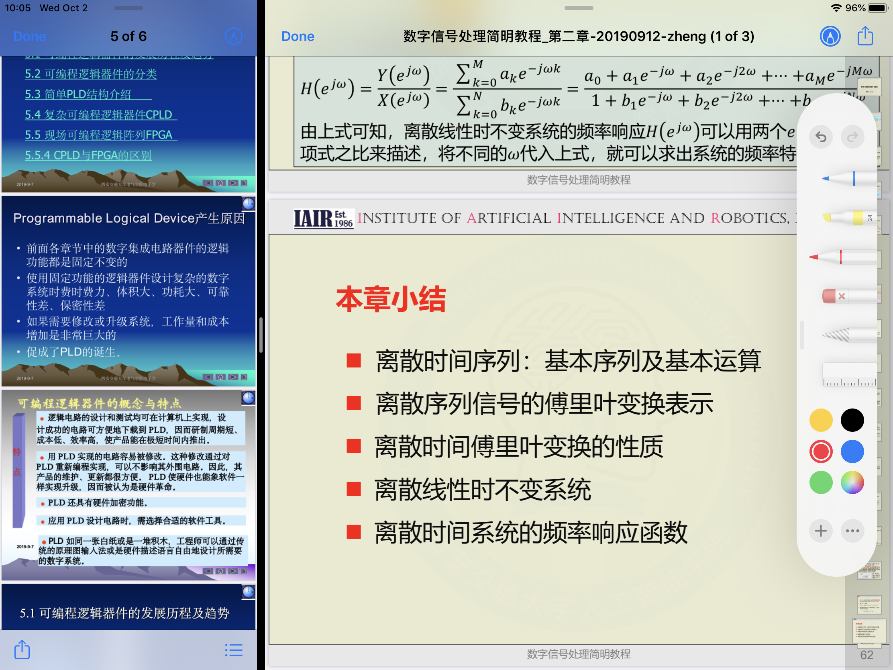
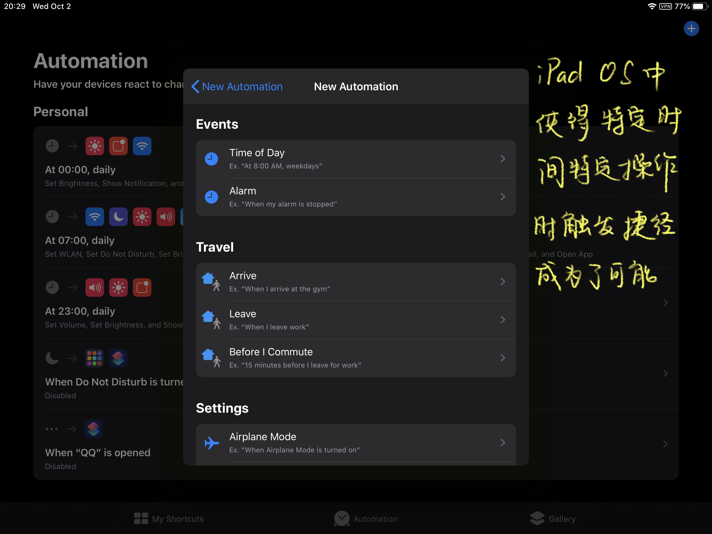
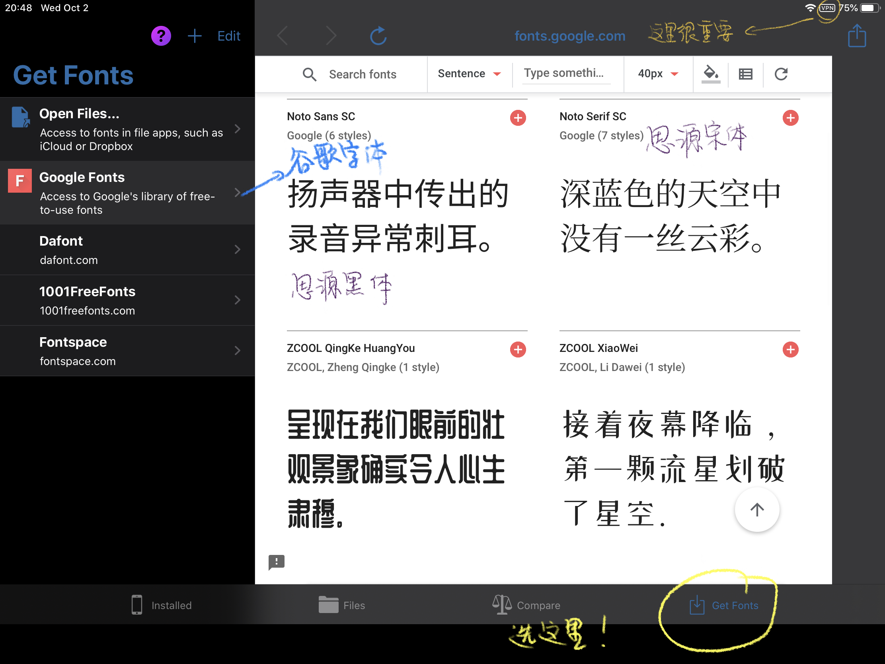
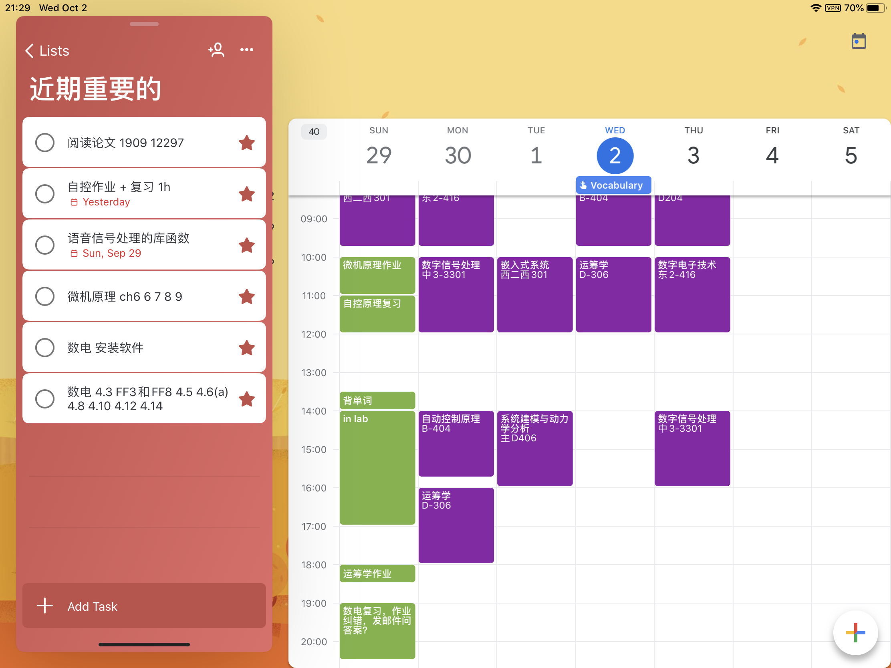

# iPad OS 使用心得

Created By: Siyuan Wu
Last Edited: Oct 02, 2019 9:46 PM

# 一篇不太正经的 iPad OS 的心得

我是在今年五月初入了2019年最新款的 iPad Air 3 ，就是一台据说是搭载了当时最强的 A12  仿生芯片，据说到目前为止也是苹果家性价比最高的 10 寸以上的大屏平板。当时为什么选择了这款平板而不是曾经心心念念的 surface ，是因为 surface go 糟糕的耗电控制、捉襟见肘的性能和早已落伍时代的 EMMC 存储芯片（其实最主要是因为 surface go 会比 iPad Air 3  贵一千来块钱，预算有限！！）。**而且下单之前我就已经做好了 “买前生产力，买后爱奇艺” 的思想准备**。 因为从种种迹象来看， iPad 系列的平板的娱乐性已经全面压制了它本来就不多的生产力，作为一名热爱学习（qiong kun liao dao）的交大学子，我很难仅仅为了做笔记一件事就说服自己添购新的硬件设备（把四千块钱全交给G胖是何等的快乐啊）。而且对于 Win + Android 党而非 Mac + iPhone 党，仅靠一件硬件很难融入整个苹果生态圈、享受生态的便利 （有两万闲钱就买外星人了）。经过内心反复多次的挣扎，最后我还是激活了 iPad （真的不是为了骗人的 Apple Aracade），然后开始享受布尔乔亚的奢靡气息。

不过很巧的是，激活后不久看到了 [ibeta.me](http://ibeta.me) 尝鲜派的开发者版本的 iPad OS 的描述文件，于是就用 Safari 下载下来进行在线更新，然后很顺利的 OTA 升级到了非官方的 iPad OS beta 版本。

使用 iPad OS  几个月之后，我也发现新 OS 中的很多有趣的细节，不妨通过这篇文章，给大家做一个分享。

## 系统新特性

### 文件

iPad OS 3 中，最让我觉得方便的是新的 **文件** 应用了。其中新加入的 **下载** 位置，新加入的扫描文档功能，新加入的PDF预览功能，还有苹果开放了对文件夹的限制，允许解压文件等等新特性，都可以极大的方便我们的学习生活。

如图，在文件视图，我们可以新建自己的文件夹，把自己对应课程的课件讲义复制到这个文件夹中，然后点击就能进入PDF文件预览模式。这里需要注意的是，文件预览模式只能批注 PDF 文件，对于老师上课提供的 .pptx .ppt .pps 格式文件，需要先批量转成 PDF 格式，然后再保存到文件目录中。

对于iPad上的 PDF 文件预览批注功能，我的感受是，不够方便。如果作为 PDF Expert 系列软件的替代品，还是可以凑合使用的。但是使用上不太方便更不够稳定。不方便的一点是，这个 PDF 的进度条在右边，很容易误触，批注的时候会跑到别的页面。另外一点是，iPad 批注的文档只能在 iPad 上面打开看，如果同步到私有云盘然后在别的设备打开，就会看到批注部分是会有一块黑色蒙版，在蒙版上才会有你注写的文字，而黑色蒙版已经挡住了原 PDF 上面的文字。 这个大概是由于苹果特立独行的 PDF 文件笔记编码格式吧。

另外是 iPad 文件中自带的扫描工具，这款工具支持自动扫描，自动识别，然后扫描之后可以自动保存为 PDF 格式，并且可以随意移动到其他文件夹。相对于曾经火爆但是已经很久不更新的微软家 Office Lens， iPad 的文件扫描虽然识别稍慢，但是功能上并不显得羸弱。哦，听说 Office Lens 已经可以扫描之后批注保存成 jpg 然后分享了？ 好吧苹果还需要致创新啊。不过鉴于微软 Onedrive 感人的同步速度（我大清自有国情），以及苹果仍不开放的内存管理（扫描了也不知道放哪里了），还是建议大家在 iPad 上面不要折腾吧

不过应用也有很多 bug ，比如说，批注的时候工具栏不太稳定，将文件中的照片转成 PDF 格式的时候会闪退，预览云端 PDF 的时候会打开错误。不过希望苹果的程序员们可以在之后的几次更新中修复这些 Bug 。

### 深色模式

深色模式是我非常喜欢的一个模式，有一种酷酷的风格。而且喻丰老师说过，黑底白字在心理学上，更容易吸引读者的注意力，因为对于大脑，它比白底黑字需要花费更多时间去处理和认知。而且新 iPad OS 中，系统默认支持根据预设时间可以在深色风格和浅色风格中变换的壁纸（虽然不够好看）。更新深色风格之后，我一直在使用的 GoodNotes 5 也推出了全黑的笔记模板。这也是一件蛮令人兴奋的事情的。

### 截图

iPad OS 的截图功能也非常友好，估计大家已经被很多果粉营销号洗脑了，不过我还是要吹一波。使用 Apple Pencil 从屏幕底部一角向屏幕中心轻轻一划，就完成了截图。如果有需要可以在截图上批注绘画打草稿。之后可以很方便的保存到图片或者文件应用。对于 Safari 上面的文章，截图功能还可以把整页保存为 PDF 。这里有个不太满意的地方是，整页截图只能保存长图，不会分页。建议大家全篇文章加载完之后再进行截图。

### 拍照和图库

不好意思，直男不配玩自拍。。。

不好意思，直男的图库里面只有表情包。。。

### 三指触控

iPad OS 中，苹果更新了对于三指触控的映射，使得文章写作的时候更加方便快捷。我觉得这里有必要为大家总结一下三指触控命令，方便大家的使用。

| 操作                 | 响应           |
| -------------------- | -------------- |
| 三指张开             | 粘贴 （paste） |
| 三指聚合             | 复制 （copy）  |
| 三指聚合  $\times$ 2 | 剪切 （cut）   |
| 三指左划             | 撤销 （undo）  |
| 三指右滑             | 重做 （redo）  |

### Shortcut

苹果的自动化应用也备受瞩目。当年捷径团队本来是独立的软件开发团队，就是因为捷径做的太好了被苹果公司高价收购，并且将原班人马招入苹果公司，开发了这款原生的捷径应用。如果你的 iPad 上面找不到叫 **捷径** 或者 **Shortcut** 的应用，你可以去 **App Store** 中下载。

在捷径应用中，你可以为你想做的事情编写程序，然后让软件自动化执行。比较简单的一些操作比如计时器、天气提醒、拍摄 gif ，都可以自己轻松上手实现。稍微复杂一点的“捷径”可以在 Gallery 中找到，如果需要更多功能，也可以从第三方网站获取别人的捷径分享。

iPad OS 中对于捷径进行了一个较大的优化和改进。在 iOS 12 时期，捷径是不支持“某个特殊的时间触发某件事”这样的操作的。但是在 iPad OS 中，添加了 **Automation** 这一强大的操作，使得特定时间触发特定的操作成为了可能。比如早上七点钟叫醒你并且向你推送今日天气、今日微博热搜知乎热榜，又比如晚上睡前自动静音自动调节亮度自动开启勿扰模式。你只需要设定某个触发条件，然后运行某些操作或者某个捷径。但是，经过一段时间的使用，我发现，这个自动化应用，并不能够一直实现无扰的自动操作。也就是说，比如我设置了，“当我打开 Wi-Fi 时，系统自动为我打开微信”。但是真正当我打开 Wi-Fi 时，系统有时候会弹出横幅询问你，是否要进行这个操作。个人而言，我更喜欢小米那种，当系统做完这一切之后再提示你，刚刚已经为你运行了自动化应用。

## 其它

### 如何装字体？

iPad OS 中，苹果公司第一次良心的支持了安装第三方字体。不过需要指出的是，这个安装字体，也只是可以在 Word 等文字应用中调用而已，而非安卓系统那样，可以更换全局字体。（所以还是只能使用无衬线的苹方字体）尽管如此，我还是想要推荐一下这个能够安装第三方字体的免费良心应用 —— **iFont**

首先，你需要在 **App Store** 中搜索 **iFont** （不是 **iFonts**），然后下载安装。之后打开应用，你就可以看到左边有一列西文字体可以安装。但是，这不是重点，你只需要点击最右边的 Get Fonts ，就可以从第三方源下载各种字体。注意，从网页上选择下载之后，稍等片刻，软件会自动把字体导入软件，然后点击第二栏 Files 安装。这还没有结束，你需要从苹果系统的设置应用中，选择通用 - 描述文件，然后确认安装。这样之后，你就可以从第三方软件的字体选项中找到你刚刚安装好的漂亮的中文字体了。 当然， **iFont** 软件自带 Google 字体库，你如果和我一样对于谷歌的思源黑体、思源宋体情有独钟，那你需要科学上网才可以访问下载。

### 科学上网

对于 iPad 使用者，不能逃避的就是科学上网了。咳咳，我大清国自有国情，为了防止河蟹，我也就少说一点吧。对应的软件如 **Shadowrocket** ，你就不要想着在国区找到了，毕竟有谷歌的前车之鉴，库克不敢乱来。你需要使用另外的邮箱，注册一个美区或者港区的账号，然后激活这个账号，从美区或港区购买。需要注意的是，美区账号需要绑定 Visa 卡或者 PayPal 之后，才能够激活。如果你没有 Visa 卡，不建议自己鼓捣。因为绑定 Paypal 会十分麻烦。这时候你就可以去某宝找代购，他们会帮你激活，并且帮助你使用礼品卡购买。当你购买成功之后，你终于有了 iPad 上的 SS/SSR 客户端。这时候挂上你在某个不可告人的地方购买的机场，就可以“跨过长城，来到大洋对岸”了。

> 小建议， Google 神机规则，你就可以一年四季开着代理了，至于细节，无可奉告。

### 代码

迄今为止，我还没有在 iPad 上找到合适的 IDE（主要还是没有闲钱去购买 68 元的 **Pythonista** ，更不敢涉足动辄上百的 **LaTeX Editor** ）只好远程做了。Web 端有一个多人合作的 LaTeX 编辑网站，叫 **OverLeaf** ，反正我实验室的师兄投论文的时候就是用的这个网站，大家可以考虑通过自己的谷歌账号注册一个账号。对于 Python 等编程语言，我还是不建议大家再去 **App Store** 进行无意义的搜寻了。大家可以尝试从阿里云以学生价格租用一个服务器，然后在服务器上配置必要的 Python / C / C++ / Java 环境，然后通过 VNC 连接到服务器远程操作。由于新的 iPad OS 提供了对于鼠标的支持，所以连接上一百元的 罗技 K380 蓝牙键盘和几十元的 蓝牙鼠标，你就可以把你的 iPad 变成移动的电脑。当然这一切的一切，是你可以保证网络的情况下。 不过相信大家要么是流量用不完，要么已经购买了学校的坑爹 STU 套餐，要么已经养成了图书馆自习娱乐的良好习惯。总之，尽管库克在发布会上吹他的 A12 芯片有多么厉害，但在实际使用中，顶级芯片的生产力已经远远被封闭的 iOS 系统所拖累。

### GTD

GTD 是一个老生长谈的话题，多说了没有什么必要，做起来比较重要。目前我为了兼顾 Android 和 iPad 两个生态，暂时采用了微软 **Microsoft To-Do** 和 **Google Calendar** 的组合。先将相关任务记录在 **Microsoft To-Do** 中，然后再对其在 **Google Calendar** 中进行安排。这里需要感谢刘贵涛同学，为自动化钱的大三课程制作了基于 **Google Calendar** 的详细课程表。

### 其他

如果大家和我一样有大量阅读论文需求的话，我建议大家试用 **Margin Note 3** 这个软件，你可以先使用两周，再决定是否要花一百元左右的价格购买。我个人比较喜欢这个软件随心所欲的标注和方便的思维导图整理。网络上已经有很多果粉吹这个软件了，所以这里不再浪费笔墨。

**iClock** 是一个很好玩的应用，可以显示时钟，如果喜欢的话可以购买，当然一般人也会买过来吃灰😂。

**Terminus** 是一个不错的免费的 SSH 应用，如果需要 SSH 远程连接服务器的话可以考虑下载。

壁纸可以考虑著名免费网站 **Unsplash**。当然曾经我负责运营钱小辅的一段时间内使用的是 Bing 每日美图。

**Notion** 在国外很火，但是本土化人家基本没做。最近推出了学生邮箱注册的免费活动，大家如果感兴趣可以去用自己的 stu.xjtu.edu.cn 邮箱注册一个账号。

**Trello** 同样，但是 **Trello** 的看板模式在国内一直不温不火，大家还是用 QQ 微信协作更顺手一些。

特别喜欢美区的一个

对于 RSS 情有独钟的同学可以下载免费应用 **RSS Prime** ，其中内置了一部分 RSS 源。（不过鉴于国内优秀的 RSS 源太少了，仅有的都是有深度有稳定受众的，还是建议大家多添加国外的 RSS 源）**欢迎大家把学辅推送添加到你的 RSS 源中。**