# 关于编写问题的若干解答

[TOC]


## 环境

目前我们使用$LaTeX$排版系统进行排版，需要大家在自己电脑上配置latex环境

*之后大家参加数学建模竞赛、做科研、发paper的时候还要不止一次的用latex*


### 编译器

 Texlive：https://www.tug.org/texlive/
 MikTex：https://miktex.org

**>>>  千万别装CTex套装  <<<**

#### TexLive

TeX Live的官方站点是[guanfang](https://tug.org/texlive/)，

可以从[官方站点](http://mirror.ctan.org/systems/texlive/Images/texlive2018.iso)下载安装包，下载地址为

但同时，也可以尝试[清华大学](https://mirrors.tuna.tsinghua.edu.cn/CTAN/systems/texlive/Images/texlive2018.iso)和[中国科技大学](https://mirrors.ustc.edu.cn/CTAN/systems/texlive/Images/texlive2018.iso)的镜像站，点击即可下载iso压缩文件。

打开下载得到的texlive2018文件，以管理员身份运行install-tl-advanced.bat，点击continue会进入安装设置界面，根据自己的需要进行设置，即可进行安装，整个安装过程可能比较长，需要耐心等待。


#### MikTex

笔者下载后和接下来要安利的TexStudio一起放到了百度网盘，以下是链接

链接：https://pan.baidu.com/s/1mWyefxDxPKvK4-ECEAgsZw 
提取码：bsmx 


#### 编辑器

 可选的文本编辑器为Atom，VSCode，Sublime Text等，Atom和VSCode软件功能较多，但是比较大。

如果只写latex语言，还能使用TexStudio

##### 关于TexStudio

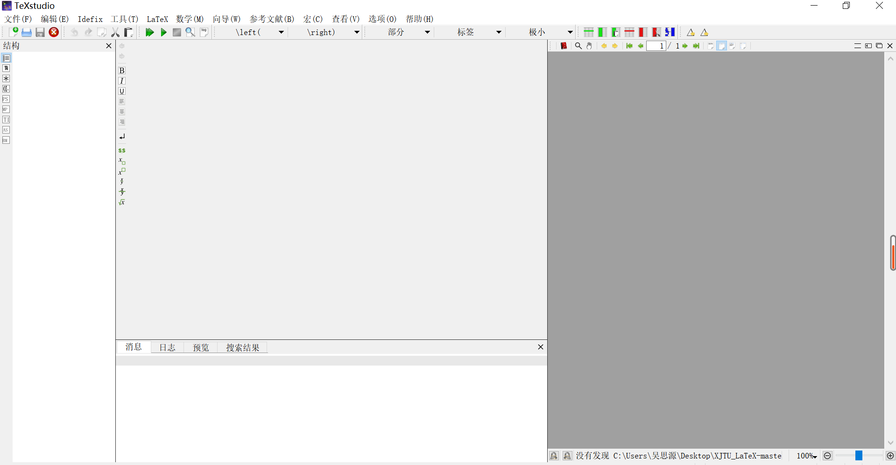


texstudio的配置可能稍微困难一点，请同学们自行百度，我记得需要在设置里面修改一些东西。太久没用了有点陌生。

刚下载下来的是英文版，需要修改语言才可以调为中文版，请百度`关于TexStudio的中文界面设置`查看详情

这个软件十分专业，功能比vscode多很多，支持对应文字查看等

书写latex，然后摁F5编译，下面会提示编译情况，错误了也会提示错在哪里

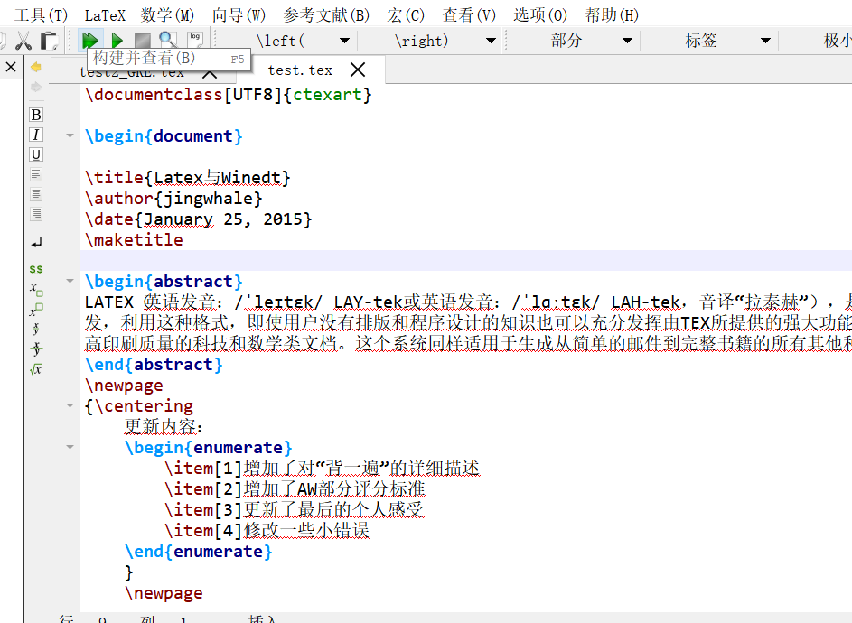

比如故意少写一个括号，立刻标红提示

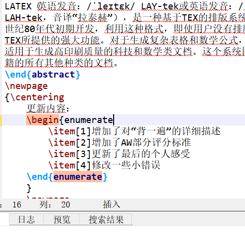

然后报错具体位置

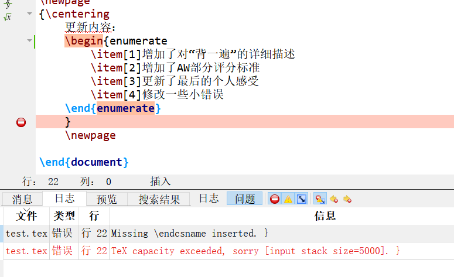

没啥好写的因为比较好用


##### 关于VScode

笔者目前win平台上的主力IDE，所以对这个比较熟悉。

下载地址https://code.visualstudio.com/

*设置中文语言需要修改json文件，可能也是比较麻烦，所以就没改*

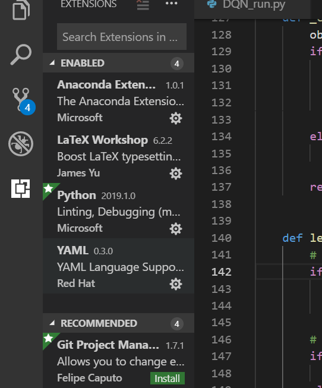

点击最下面的这个图标（安装插件），搜索LaTeX WorkShop

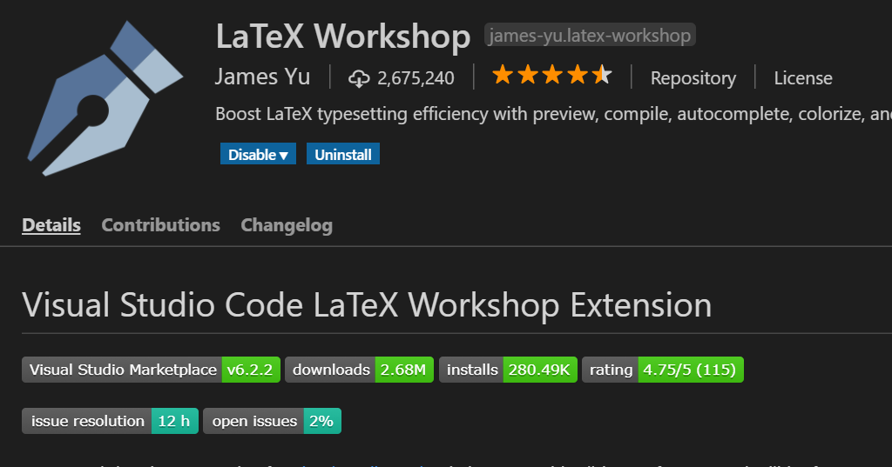

然后点击下载就行，下载之后enable


可以`File -> OpenFolder` 然后新建一个文件，文件名`test.tex`

(或者直接`New File`, 但是文件名一定要后缀为`.tex`)

这时候左边会变成这个样子

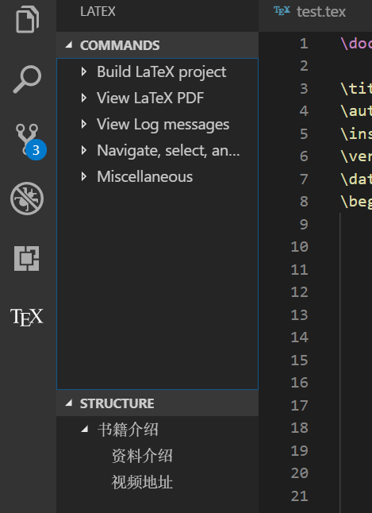

编译时

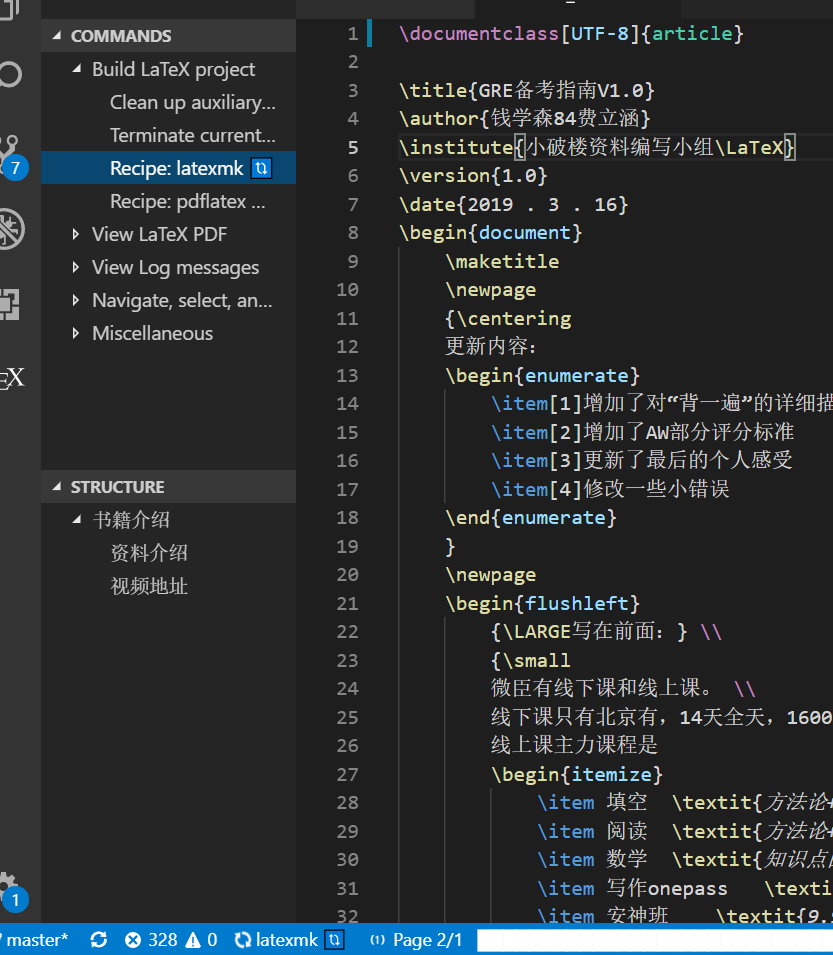

点击`Recipe: latexmk`（当然ctrl + s 保存自动编译）

*千万不要按F5！！！ 因为按F5是运行程序，在vscode中latex只是排版语言，没有对应的编译器去运行latex程序*

下面会显示编译进度，右下角会弹出来编译结果

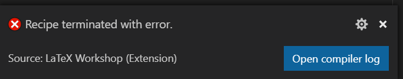

弹出来这个框说明代码写错了hhhhhhhhhh

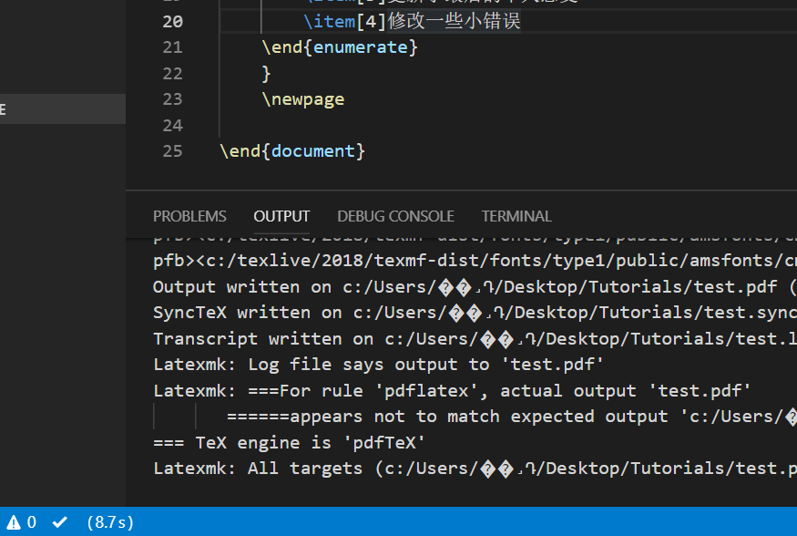

然后点击output找语法错误改错误，如果下面出现  √  说明编译成功，而且可以看到编译所用的时间。

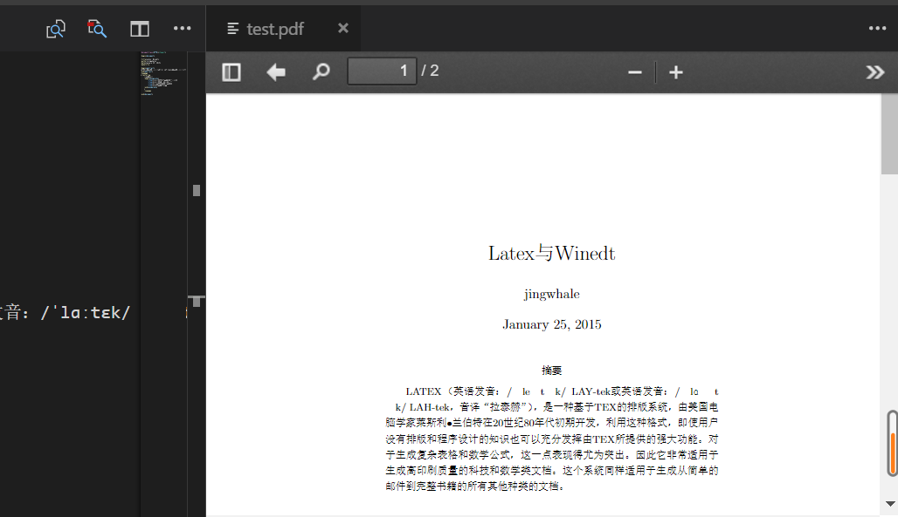

点击第二个按钮（就是红点放大镜）可以查看pdf，当然也可以选择浏览器查看。

最后记得点击`Clean up auxiliary files`


## 示例

```latex
% 请设置解释器为xelatex的同学运行此程序
\documentclass[a4paper, fleqn, twocolumn]{article}
\usepackage{xeCJK, geometry, amsmath, amssymb, graphicx}
\geometry{left=2.0cm, right=2.0cm, top=2.5cm, bottom=2.5cm}
\setCJKmainfont{SimSun}
\begin{document}
\section*{第二章}
\newcommand{\di}[1]{\mathrm{d}#1}
    一、选择题\\
    \newline
        1.{\LARGE \textbf{C}}\par
        质点沿力方向位移为零。$\therefore A=0$.\\
    \newline
        2.{\LARGE \textbf{B}}\par
        $B$离开$A$时为弹簧恢复原长的时刻(该时刻之后，$A$受到弹簧拉力，加速度为负，$v_A<v_B$.)\par
        此时$v_A=v_B$.由动能定理：
        \begin{align*}	
            \frac{1}{2}mv_A^2+\frac{1}{2}mv_B^2-0=\frac{1}{2}kd^2\\
            \therefore{}E_B=\frac{1}{2}mv_B^2=\frac{1}{4}kd^2
        \end{align*}
        \newline
        3.{\LARGE \textbf{C}}\par
        对$\vec{r}$求导：
        \begin{align*}
            \vec{v}&=\frac{\di{\vec{r}}}{\di{t}}\\
            &=-\frac{2\pi}{T}A\sin\frac{2\pi t}{T}\vec{i}+\frac{2\pi}{T}B\cos\frac{2\pi t}{T}\vec{j}
        \end{align*}
        \par$t=0$时，
        \begin{align*}
            v_1&=\sqrt{v_{x1}^2+v_{y1}^2}\\
            &=\sqrt{0^2+\left(\frac{2\pi}{T}B\right)^2}=\frac{2\pi}{T}B
        \end{align*}
        \[\therefore{}E_{k1}=\frac{1}{2}mv_1^2=\frac{2m\pi^2}{T^2}\left(B^2\right)\\\]
        \par$t=\frac{T}{4}$时，
        \begin{align*}
            v_2&=\sqrt{v_{x2}^2+v_{y2}^2}\\
            &=\sqrt{\left(-\frac{2\pi}{T}A\right)^2+0^2}=\frac{2\pi}{T}A
        \end{align*}
        \begin{gather*}
            \therefore{}E_{k2}=\frac{1}{2}mv_2^2=\frac{2m\pi^2}{T^2}\left(A^2\right)\\
            \therefore\Delta{}E_k=\frac{2\pi^2}{T^2}(B^2-A^2)
        \end{gather*}
       \newline
  \end{document}
```


```latex
% 用vscode同学请运行此程序
\documentclass[UTF8]{ctexart}
 
\begin{document}
 
\title{Latex与Winedt}
\author{jingwhale}
\date{January 25, 2015}
\maketitle
 
\begin{abstract}
LATEX（英语发音：/ˈleɪtɛk/ LAY-tek或英语发音：/ˈlɑːtɛk/ LAH-tek，音译“拉泰赫”），是一种基于TEX的排版系统，由美国电脑学家莱斯利•兰伯特在20世纪80年代初期开发，利用这种格式，即使用户没有排版和程序设计的知识也可以充分发挥由TEX所提供的强大功能。对于生成复杂表格和数学公式，这一点表现得尤为突出。因此它非常适用于生成高印刷质量的科技和数学类文档。这个系统同样适用于生成从简单的邮件到完整书籍的所有其他种类的文档。
\end{abstract}
\newpage
{\centering
    更新内容：
    \begin{enumerate}
        \item[1]增加了对“背一遍”的详细描述
        \item[2]增加了AW部分评分标准
        \item[3]更新了最后的个人感受
        \item[4]修改一些小错误
    \end{enumerate}
    }
    \newpage
 
\end{document}
```


另外一个示例，采用了[elegantnote](https://elegantlatex.org/cn/elegantnote/)的模板（需要另外安装）


```latex
\documentclass[blue,pad,cn]{elegantnote}

\title{托福备考心得}
\author{越杰81张佳慧}
\institute{小破楼资料编写小组\LaTeX}
\version{1.00}
\date{2019 年 3 月 16 日}

\begin{document}

\maketitle
\newpage
\tableofcontents
\newpage
\section{介绍}

    \begin{flushright}
        笔者托福首考侥幸获得了29+30+29+30=118的分数，于是写下一点点个人体会，仅供参考。
    \end{flushright}
    
    \emph{我从2018年九月份开始在新航道交大班进行托福学习，期间除了做老师发布的任务没有做很特别的事情.}
    不过值得一提的是，我有一个从初中以来的爱好，就是看美剧，我一般选择《生活大爆炸》《破产姐妹》《实习医生格蕾》
    等最近的（保证从中学到的表达不会过时）、比较轻松的（可以把一部分注意力分给英语而不是紧盯剧情）美国剧目来看，
    听某站某up主讲过，看美剧的时候可以自己在下面说一些
    
    \begin{quote}
        “I know, right?” 
    \end{quote}

    \begin{quotation}
        “I know, right?” 
        “Yeah, she is totally insane.”
    \end{quotation}
    
    等语句呼应美剧中角色的台词，这样听到的是英语、说的是英语，慢慢的就容易用英语思考，
    曾经有一段时间，我想说很多东西脑海中第一个出现的竟然都是英语表达；一月中旬新航道结课、进入寒假之后，我主要在家自学，
    也没有花很多时间，一般就是白天学几个小时，再看一会儿\underline{《实习医生格蕾》和《少年谢尔顿》}，晚上放松。

\section{听力}

    听力方面我没有做很特别的事，总结下来，我认为最重要的有两点。

\subsection{1}
    第一个是熟记学科词汇以及北美大学生活常用词汇，因为上述词汇有很大一部分普通托福词汇上是没有的，
    而它们又对听力材料的理解有着举足轻重的作用，可以想象，如果你可以完完全全没有任何障碍的听懂一篇约四五分钟的材料，
    那做对五六道题一定是没有问题的。

\subsection{2}
    第二个是找到适合自己的方法，这里所说的方法主要是指\textbf{笔记}方面。
    我个人尝试了记笔记和不记笔记两种方式，一开始我是记笔记的，但是我经常在写字的时候就听不到录音在说什么，
    再加上我当时的迷之自信，我开始尝试不记笔记，但我又发现我的注意力持续时间并不够长，如果不做笔记最后一篇lecture的错误率会非常高，
    最后我又回归了笔记，{\small}而且还是{\tiny缩进式笔记}；
    首先我通过很多TPO练习，找到了\textit{“记笔记”和“听得见”}之间的微妙平衡，达到了几乎不让记笔记影响我的听解率的效果；
    其次，在我看来缩进式最大的好处是在记笔记的过程中我也在思考，这使得我对材料的印象更加深刻，所以虽然我在做题目的时候几乎不看笔记，
    但我的正确率不会受到影响。

\section{阅读}

    由于我没有用托福词汇书背单词\textsl{（我现在认为这点很不可取，希望大家不要模仿我，好好背单词）}
    ，我的词汇积累大部分来自{\LARGE阅读}，我会在做完一套阅读TPO之后，阅读纸质版的文章，勾画生词并查明意思，
    如果有可能对写作有帮助的词，我会看英文解释并且拓展搜索可以在作文里运用的搭配、表达，除了生词我还会勾画文章里的高级表达，
    正如我的写作老师所说，在托福里学托福再靠谱不过了。

\section{口语}
    作为一个土生土长、只在国外呆过半个月的中国人，我的语音语调和语言组织能力主要来自从小一些优良习惯和日常习惯就不多说了。\\
    日常练习就是指我在有机会的时候就会和再国外上学的同学用英语打电话，\hspace{2.5cm}而且时不时的会和朋友、舍友讲英语，
    这件事在很多人看起来有点神经，但是我真的认为它潜移默化的提高了我的语言组织能力，如果有一次某个意思你想了很久才表达出来，
    那么很大几率下一次你就能直接说出来，这大概就是这项有点神经质活动的意义所在。


    在口语答题方面，我认为需要注意的有两点。
\begin{remark}
    第一个是逻辑，我的老师说其实语音语调并没有特别的重要，最低标准是让人听懂，
    那么除了语音语调之外就是内容的组织了，其中逻辑就很重要，要懂得使用“first”“on the other hand”等连接词，
    即使内容没有那么逻辑清晰，形式逻辑也是一定要保证的。
\end{remark}

test

\begin{note}

    第二个是材料里提到的要点要全，要达到这点就要勤加练习口语中的笔记记录。

\end{note}


\section{写作}
综合写作主要是写全要点，结构清晰，这个大部分人都能满分。\\[5cm]
独立写作要注意思维的逻辑，从这一步推到下一步，一定要是一步可以推理到的，如果跳步的话就会显得不严谨，
所以如果能做到论证时层层深入、丝丝入扣，那已经成功了一半了。
最后就是高分词汇、高分表达的积累要不能停，背的时候要多想想能在哪些情况下使用。

\begin{lemma}
    我们写作老师讲的内容、给的模板都太靠谱了，写作部分真的就没什么好说的了。
\end{lemma}

\end{document}
```


## Latex 教程推荐

[从零开始latex快速入门](http://liuchengxu.org/blog-cn/posts/quick-latex/)   http://liuchengxu.org/blog-cn/posts/quick-latex/  *需要梯子*

[常用符号的latex表示方法](http://mohu.org/info/symbols/symbols.htm)  http://mohu.org/info/symbols/symbols.htm 

[实战经验](https://blog.csdn.net/simple_the_best/article/details/51244631) https://blog.csdn.net/simple_the_best/article/details/51244631 

[数学公式排版](https://zhuanlan.zhihu.com/p/24502400) https://zhuanlan.zhihu.com/p/24502400 

[参考文献排版](https://zhuanlan.zhihu.com/p/25013341)  https://zhuanlan.zhihu.com/p/25013341


